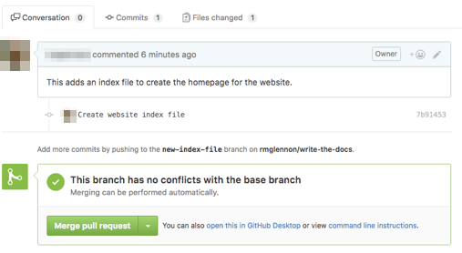

# Learn GitHub by building a documentation website

GitHub is a website that enables people to collaborate on projects, and many organizations use it for managing both software code and documentation. You will get started with GitHub by applying its tools to creating a website.

In this tutorial, you will:

- Get an introduction to the Git version control system, terminology, and the GitHub workflow.
- Create a simple website with the free hosting service from GitHub, called GitHub Pages.
- Learn how you can take your new skills and to support other open-source projects.

In GitHub terms, you will fork a repository, add some files and content to it, open a pull request, merge files, and enable GitHub Pages to create your website.

To complete the tutorial, you need a [GitHub account](https://help.github.com/articles/signing-up-for-a-new-github-account/), a browser, and an internet connection.

## Get to know the terms

While this tutorial assumes some knowledge of basic computing terms, you may not be familiar with the concepts for Git and GitHub. To get started, review the following terms.

_[Git](https://en.wikipedia.org/wiki/Git)_ is software that enables multiple people to work together on a project. It was developed by [Linus Torvalds](https://en.wikipedia.org/wiki/Linus_Torvalds), who created the Linux kernel that is used in Linux, macOS, Android, and other operating systems.

_[GitHub](https://github.com)_ is a website where you use Git tools to collaborate on a project.

You can think of a _repository_ as the folder for a project, which contains all of the component files, such as code, documentation, and examples. Open-source software uses public repositories that are visible on the GitHub website.

To work on a project, you need to make your own _branch_ of a repository, which is a parallel version that contains your changes. When you are done working, you can propose that your changes be added into the main, or _master branch_ of the project by opening a _pull request_. Other _collaborators_ who have write access to the project can review and approve your work.

## Copy the files into your own account

You will start by making a copy of the tutorial data files. You need to do this because you do not have write permissions the source version, but you can if you make copy in your own account. This is known as creating a _fork_, or _forking a repository_.

1. Open a browser to https://github.com and sign in with your account.
2. Navigate to https://github.com/rmglennon/write-the-docs, which contains some files to get you started.
4. Click the `Fork` button in the top right corner of the page.
5. If you are a member of a GitHub _organization_, which is a group of users, you need to choose where to place the forked repository. In most cases, you should choose the option that will put the copy into your own, personal account.

You now have a copy of the files that you can edit. If you look at the repository name, it shows the name of the location from which it was forked.

_Tip: Sometimes, you may want to download a copy of a repository to your local machine. Doing this allows you to work offline, use more sophisticated editing tools, such as a text editor or integrated development environment, and work with git through a [command-line interface](https://git-scm.com/book/en/v2/Getting-Started-The-Command-Line). These workflows are beyond the scope of the tutorial._

## Explore the files

In this tutorial, you will be using the GitHub website to modify the files.

1. Look at the files in your forked repository. These files include information about the repository's license, files to ignore (for example, your operating system creates certain files as you browse, and these should not be tracked with your project), a readme, and a `docs` folder.
2. Double-click the `docs` folder to display its contents. It contains a `css` folder, which imports a visual theme for the website you will create, and `_config.yml`.

These files are used with a software library known as [Jekyll](https://jekyllrb.com/) that converts text files, such as the markdown files you see here, into a static website or blog. Jekyll is very flexible and can be configured in many ways, and you can [review the documentation](https://jekyllrb.com/docs/home/) to learn more about how to customize it for your site.

_Tip: The site template and layouts you are using are from a theme called Minima, which is the built-in style for Jekyll. You can see an example and view the open-source code in the [Minima repository](https://github.com/jekyll/minima)._

## Create a homepage

Your fork has the basic configuration to get a website built with Jekyll, but does not have any content in it. You need to create an index file to serve as the homepage of your website.

1. Be sure you are in the  `docs` folder (the path should be `write-the-docs/docs`) and click `Create new file`.

  

2. In the `Name your file` box, type `index.md`. This creates a new markdown file. It is very important that you include the `.md` file extension in the name; otherwise, your website will not be generated.
  _Tip: If you ever need to create a new subfolder in your directory structure, you can type the folder name and a `/` after it, and then the filename._
3. On the `Edit new file` tab, add the following text.
  ```
  ---
  layout: default
  title: Workshop instructions
  ---

  Hello, world!
  ```

The text between the two lines of hyphens (`---`) is metadata, known as front matter, that Jekyll processes to display the page. You can use variables and other options in the front matter to customize your site.

Here, you are setting the page layout and giving the page a title. The content that comes after this is what is displayed on your page (Hello, world!).

## Open a pull request for your edits

In GitHub, a _[pull request](https://help.github.com/articles/about-pull-requests/)_ is the way you propose your changes to a project.

You can think of the _master branch_ as being the production version of your project. It is good practice to create a pull request for your changes, rather than committing directly into the master branch. With a pull request, other people can review and verify your changes, making it less likely that you will introduce a problem that could destabilize the project. It is also easier to revert a change if it originated from a pull request.

1. Scroll to the `Commit new file` section of the page.
2. In the first box, type `Create website index file`. This is a commit message, which is useful for explaining your work and helps you keep track of the changes. If you do not add any text, GitHub includes a default message.
3. Click `Create a new branch for this commit and start a pull request.`
4. GitHub automatically suggests a branch name based on your username. You can use it or type your own, such as `new-index-file`.

  

5. Click `Propose new file`.
  The page refreshes and you are on a page where you can open a pull request to propose your changes be merged into the master branch. The subject of the pull request is the commit message you typed before.
6. Add some additional information about your the changes you are proposing in the comment box, such as `This adds an index file to create the homepage for the website.`

  

7. Scroll the page and review the other information displayed on the pull request. For example, you can see the list of commits (there is only one) and the changes you made.
8. Click `Create pull request`.

_Tip: Repository administrators can restrict who can merge into the master branch or have settings to require approval from other contributors before merging. Because you are working in a repository in your own account, you technically have the ability to merge into the master branch. However, you should still follow the recommendation and create a pull request in your own projects._

## Merge changes into the master branch

You have opened a pull request in your repository, and now need to approve the changes and merge them into the master branch.

Most of the time, other collaborators review and approve your pull request before you merge it. GitHub has [additional reviewing functionality](https://help.github.com/articles/about-pull-request-reviews/) , including adding comments on individual lines of code and requiring changes to be made before the pull request can be merged.

In this case, you are the only contributor and need to review your own changes.

1. Review the information on the pull request page.

  

2. Below the merge section, type a comment and click `Comment`. Comments are used to discuss the changes. You can use emoji and markdown in your comments.

  

3. Click `Merge pull request`. Your changes do not conflict with the master branch, so you can merge automatically. If there were conflicts, you need to reconcile them by choosing whether to keep the master version or your edits. You may need to use command-line options to review and fix merge conflicts.
4. Click `Confirm merge`.
5. Click `Delete branch` to remove the temporary branch you made to add the index file.

  

You have now merged your changes into the master branch, and the pull request status shows as `Merged`. Congratulations if this was your first pull request!

## Enable GitHub Pages on the repository

[GitHub Pages](https://help.github.com/articles/what-is-github-pages/) is a free website-hosting service for repositories stored on GitHub. You can use GitHub pages for a variety of projects, including your personal blog or a corporate website.

To use GitHub Pages, you need to specify the source of the files used to build the website. In the simplest workflow, you can publish the site from either of these sources:

- the entire master branch, which is useful if the repository only contains files used for the website
- the contents of a folder named `docs` in the master branch

The option to use the `docs` folder, which is what you will be doing, allows you to store documentation in the same repository alongside the code it describes. The repository you forked contains all the stylesheets needed to build a website, but GitHub Pages has other options for building your own themes or custom sites.

1. Click `Settings` near the top of the page.

  

2. On the main `Options` tab, scroll to the `GitHub Pages` section.
3. Under `Source`, click `master branch /docs folder`.

  

4. Click `Save`.
5. After the page refreshes, scroll back to the `GitHub Pages` section, if necessary, and notice that there is a banner indicating your site is ready to be published.
7. Refresh the page again. You should now see a note that indicates your site has been published and its URL.
8. Click the URL to view your website (you may want to open it in a new browser tab). If you get a 404 error, keep trying because it may take a few minutes to generate the site.

After the page loads, your should have a formatted website with one page, a header and footer (this comes from the settings in `_config.yml`), and the "Hello, world!" text you entered in the index file.

## Add content to your page

You are going to replace the "Hello, world!" text with real content. You can copy and paste text from a sample markdown file in this repository.

1. Go back to your GitHub repository.
2. In the root level of the repository, find and open the file named `XXXXXXXXX`.
3. Click the `Raw` button to view the raw text, including the markdown formatting tags.

  

4. Select all the text and copy it.
5. Navigate to the `index.md` file in the `docs` folder.
6. Click `Edit this file`.

  

7. Delete the "Hello, world!" text, making sure to leave in place the front matter section above it.
8. Paste the text you copied.
9. Following the same workflow you did before, commit your changes into a new branch and start a pull request.
10. Open the pull request, merge your changes into the master branch, and delete the temporary branch.
11. Refresh your website to see your changes.

_Tip: If you have closed the browser tab with your GitHub Pages website, you can go back to your repository settings and find the link to the site there._

## Next steps

### Enhance your website

Your basic website is complete. On your own, here are some of the tasks you can do to continue enhancing it.

1. Add more pages to your website.
  - Files you add in the `docs` folder will be at a URL that matches the file name. For example, `about.md` will display at `/about`.
  - Add a blog to your site by creating a `_posts` folder in the `docs` folder. By default, files should be named `YYYY-MM-DD-my-new-post.md`, where YYYY-MM-DD is the year, month, and day it is posted and the file name. This shows up on your site at a URL similar to `YYYY/MM/DD/my-new-post`.
2. Customize the site configuration.
3. Experiment with other themes, including the automatic site generation tools under the repository settings.
4. Make a local copy of the repository and use the command-line interface to modify the files.

_Tip: If you want to remove your GitHub Pages site or delete the repository, open the repository settings._

### Contribute to other open-source projects

Now that you are familiar with using GitHub, you can use this same workflow to collaborate on the many open-source projects that are hosted there.

Documentation can be an easy way to get started contributing to a project. For example, if you find a typographic error in a documentation page and can locate the source file, you can suggest a fix and become a contributor to the project. In fact, if you click the `Edit this file` button, GitHub automatically creates a fork that you can edit and opens a pull request on the original project.

If you find a bug or have suggestions for a project but are unable or do not want to make them yourself, report an _issue_ in the repository to notify the contributors. You can also use the issues list to find known problems that you may be able to fix, which are often tagged with `help wanted`.

GitHub repositories often contain [guidelines for contributing](https://help.github.com/articles/setting-guidelines-for-repository-contributors/) to the project, including how to format your pull request and the code of conduct. Review and follow these instructions to help maintain a positive open-source community.
